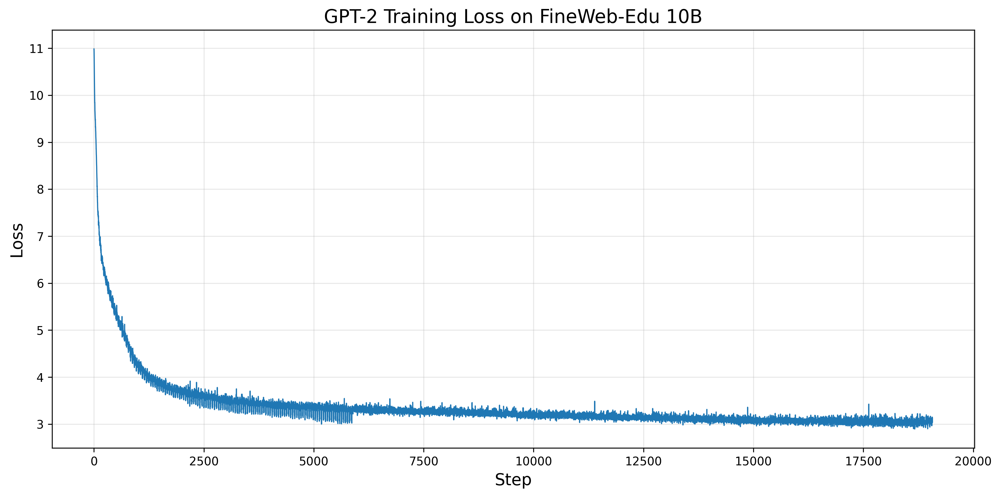
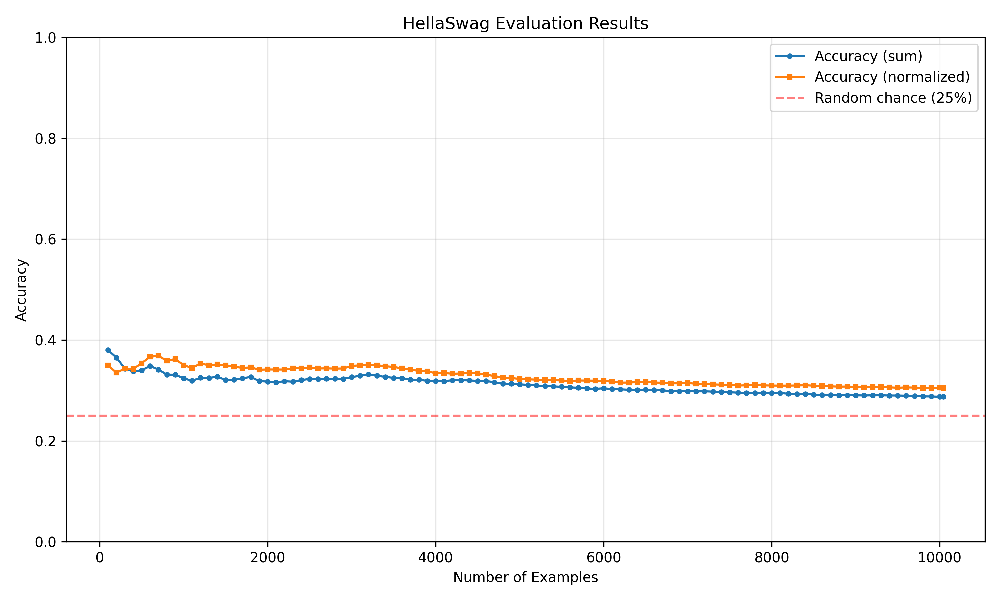

# GPT-2 Training on FineWeb-Edu 10B

Training GPT-2 (124M parameters) from scratch on the FineWeb-Edu 10B token dataset.



## Model Architecture

- **Parameters**: 124M
- **Layers**: 12
- **Heads**: 12
- **Embedding dimension**: 768
- **Context length**: 1024 tokens
- **Vocabulary size**: 50,304 (padded from 50,257)

## Dataset

- **Source**: HuggingFace FineWeb-Edu (sample-10BT)
- **Size**: 10 billion tokens
- **Split**: 100M validation / 9.9B training
- **Tokenizer**: GPT-2 BPE

## Setup
```bash
# Install dependencies
uv sync

# Download and tokenize dataset
HF_HOME=/mnt/vstor/courses/csds312/cvx166/GPT2/hf_cache uv run fineweb.py
```

## Training

### Batch Job (Recommended)
```bash
sbatch train.sh
```

### Training Configuration

- **Batch size**: 524,288 tokens (B=64, T=1024, grad_accum=8)
- **Learning rate**: 6e-4 with cosine decay to 6e-5
- **Warmup steps**: 715
- **Total steps**: 19,073
- **Optimizer**: AdamW (β1=0.9, β2=0.95, ε=1e-8)
- **Weight decay**: 0.1
- **Gradient clipping**: 1.0
- **Precision**: bfloat16 mixed precision

## Hardware & Performance

- **GPU**: NVIDIA H100 (80GB)
- **Throughput**: ~260K tokens/sec
- **Training time**: ~10 hours
- **CPU hours**: ~110 hours

## Results

### Training Metrics
- **Final training loss**: 3.0
- **Final validation loss**: ~3.1

### HellaSwag Evaluation
Common sense reasoning benchmark (multiple-choice question answering):
- **Accuracy (normalized)**: 30.5%
- **Accuracy (sum)**: 28.8%
- **Random baseline**: 25.0%



The model performs comparably to the original GPT-2 (124M) baseline on HellaSwag, demonstrating successful training and meaningful language understanding beyond random chance.

## Evaluation

### Run HellaSwag Evaluation
```bash
uv run hellaswag.py
```

This will:
- Download the HellaSwag validation set (~10K examples)
- Evaluate the trained model
- Log results to `log/hellaswag_results.jsonl`

### Plot Results
```bash
# Plot training metrics
python plot.py

# Plot HellaSwag evaluation
python plot_hellaswag.py
```

## Monitoring
```bash
# Check job status
squeue -u cxv166

# View training logs
tail -f slurm-*.out
```

## File Structure
```
GPT2/
├── train_gpt2.py           # Main training script with GPT-2 implementation
├── Dataloaderlite.py       # Distributed data loader
├── fineweb.py              # Dataset download and tokenization
├── hellaswag.py            # HellaSwag evaluation script
├── plot.py                 # Training metrics plotting
├── plot_hellaswag.py       # HellaSwag results plotting
├── train.sh                # SLURM batch submission script
├── log/                    # Training outputs
│   ├── model_final.pt      # Final model checkpoint
│   ├── metrics.jsonl       # Training metrics log
│   ├── hellaswag_results.jsonl  # HellaSwag evaluation log
│   ├── training_loss.png   # Training loss curve
│   ├── validation_loss.png # Validation loss curve
│   ├── learning_rate.png   # Learning rate schedule
│   ├── throughput.png      # Training throughput
│   └── hellaswag_accuracy.png  # HellaSwag evaluation plot
├── hellaswag/              # HellaSwag dataset cache
│   └── hellaswag_val.jsonl # Validation split
├── edu_fineweb10B/         # Tokenized training data            
├── README.md               # This file
├── .gitignore              # Git ignore rules
├── .python-version         # Python version (3.12)
├── pyproject.toml          # Project dependencies
└── uv.lock                 # Dependency lock file
```

## References

- **Architecture**: Based on GPT-2 from [Radford et al. (2019)](https://cdn.openai.com/better-language-models/language_models_are_unsupervised_multitask_learners.pdf)
- **Dataset**: [FineWeb-Edu](https://huggingface.co/datasets/HuggingFaceFW/fineweb-edu)
- **Evaluation**: [HellaSwag benchmark](https://arxiv.org/abs/1905.07830)