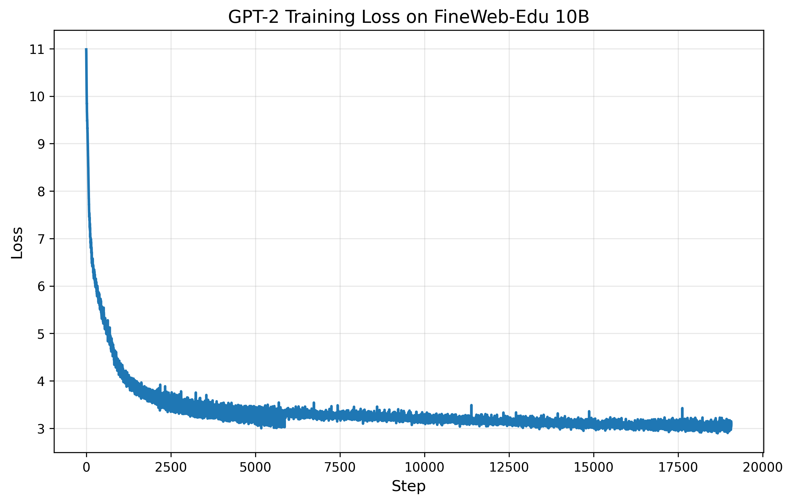

# GPT-2 Training on FineWeb-Edu 10B

Training GPT-2 (124M parameters) from scratch on the FineWeb-Edu 10B token dataset.



## Model Architecture

- **Parameters**: 124M
- **Layers**: 12
- **Heads**: 12
- **Embedding dimension**: 768
- **Context length**: 1024 tokens
- **Vocabulary size**: 50,304 (padded from 50,257)

## Dataset

- **Source**: HuggingFace FineWeb-Edu (sample-10BT)
- **Size**: 10 billion tokens
- **Split**: 100M validation / 9.9B training
- **Tokenizer**: GPT-2 BPE

## Setup
```bash
# Install dependencies
uv sync

# Download and tokenize dataset
HF_HOME=/mnt/vstor/courses/csds312/cvx166/GPT2/hf_cache uv run fineweb.py
```

## Training

### Batch Job (Recommended)
```bash
sbatch train.sh
```

## Training Configuration

- **Batch size**: 524,288 tokens (B=128, T=1024, grad_accum=4)
- **Learning rate**: 6e-4 with cosine decay to 6e-5
- **Warmup steps**: 715
- **Total steps**: 19,073
- **Optimizer**: AdamW (β1=0.9, β2=0.95, ε=1e-8)
- **Weight decay**: 0.1
- **Gradient clipping**: 1.0
- **Precision**: bfloat16 mixed precision

## Hardware & Performance

- **GPU**: NVIDIA H100 (80GB)
- **Throughput**: ~260K tokens/sec
- **Training time**: ~10 hours
- **CPU hours**: ~110 hours

## Results

Final training loss: **3.0**

## Monitoring
```bash
# Check job status
squeue -u cxv166

# Monitor training output
tail -f logs/train_<JOBID>.out

# Plot training metrics
python plot_metrics.py
```

## File Structure
```
GPT2/
├── train_gpt2.py           # Main training script
├── fineweb.py              # Dataset download and tokenization
├── Dataloaderlite.py       # Data loader
├── train.sh                # SLURM batch script
├── edu_fineweb10B/         # Tokenized dataset shards
├── log/                    # Checkpoints and metrics
│   ├── metrics.jsonl
│   └── model_*.pt
├── logs/                   # SLURM output logs
└── loss_curve.png          # Training loss plot
```
